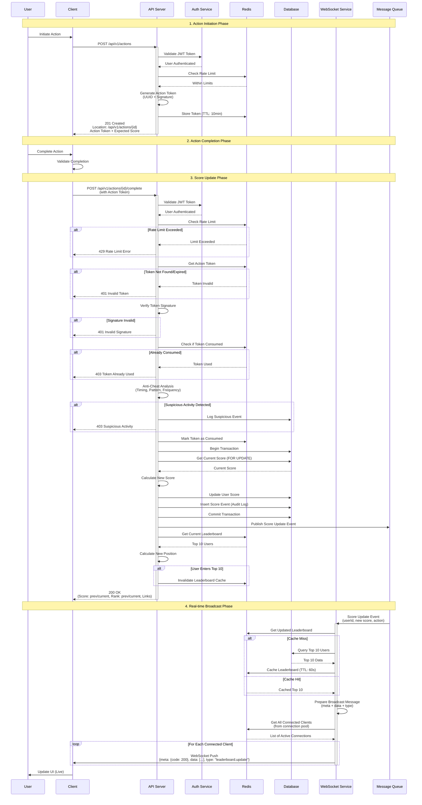
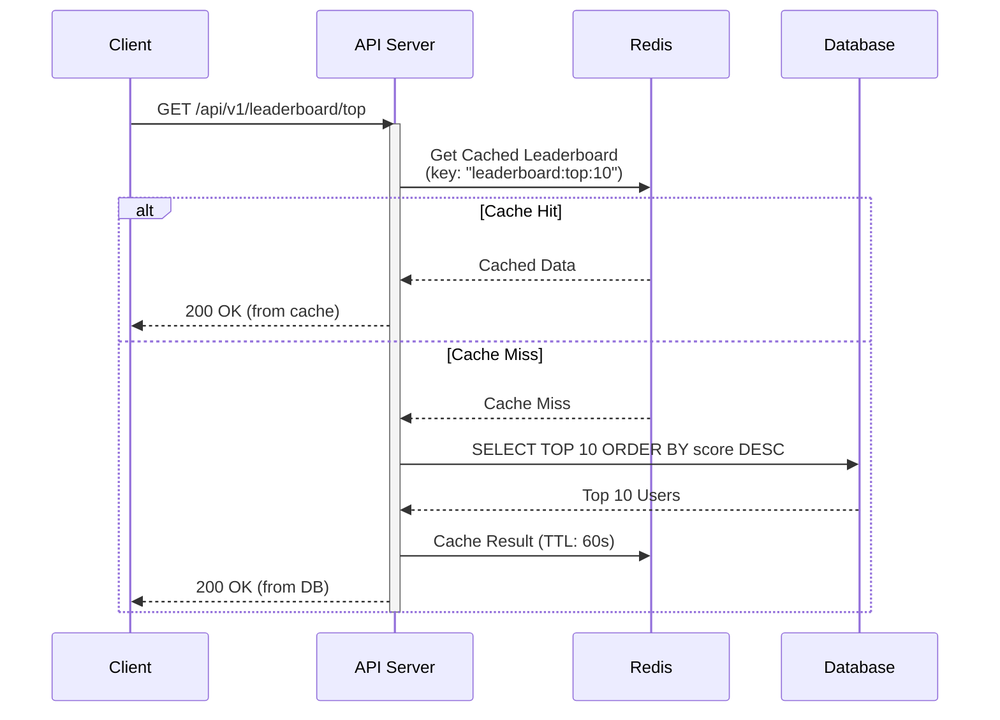
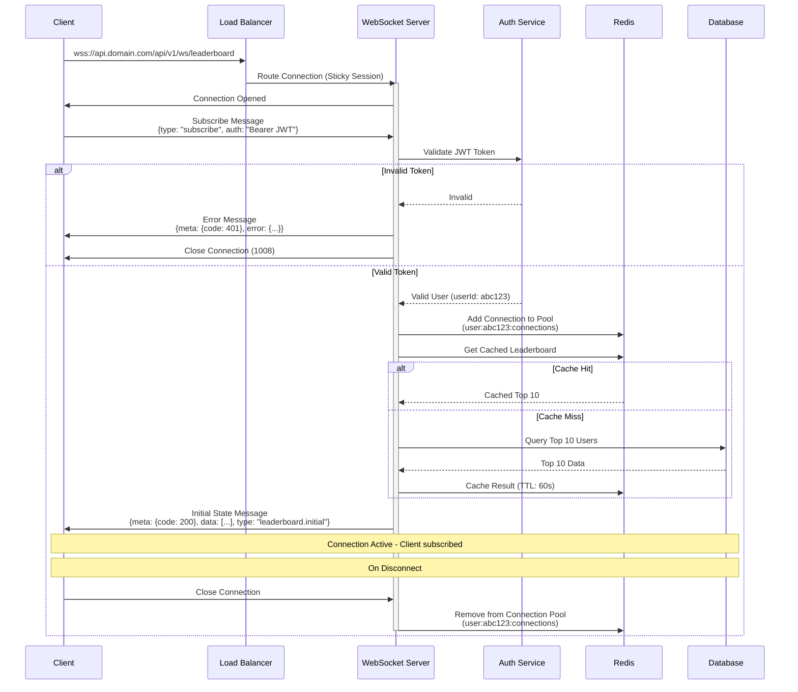
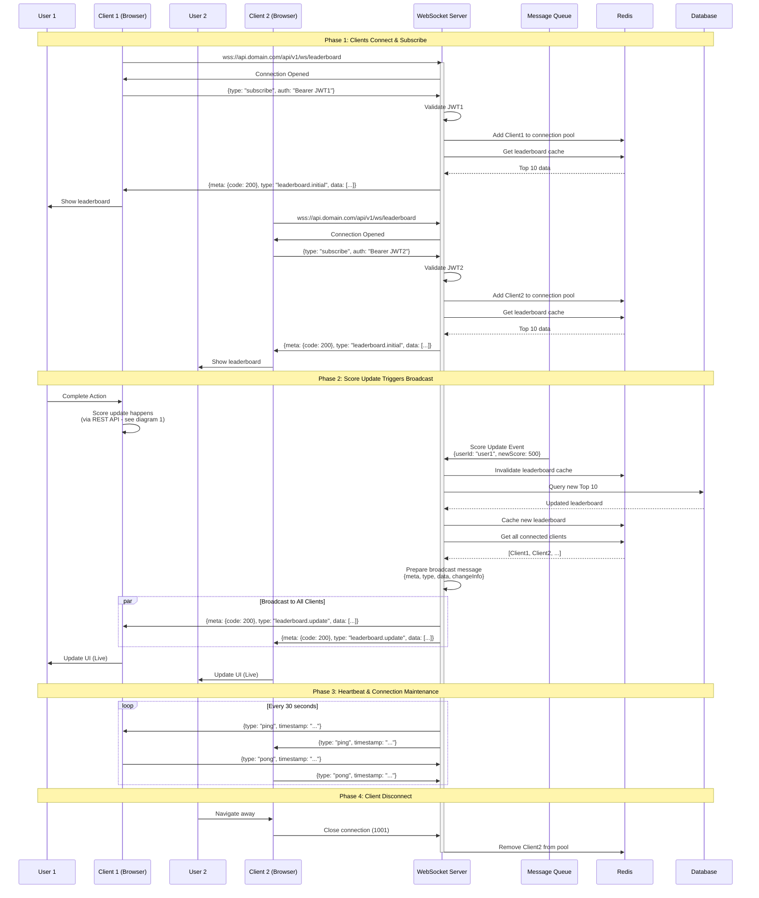
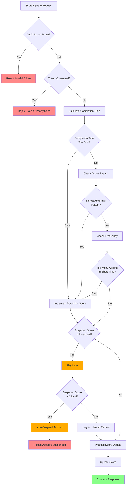
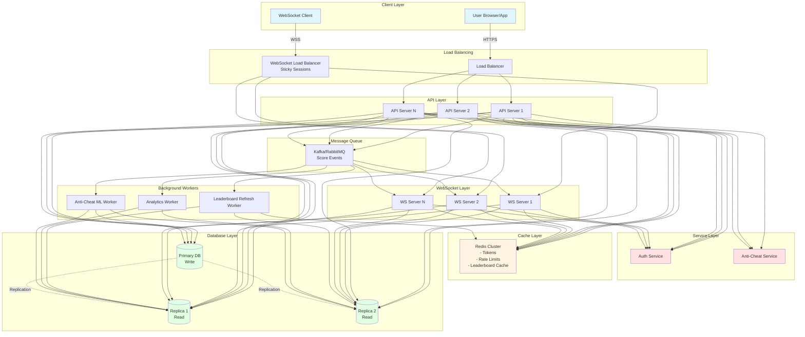
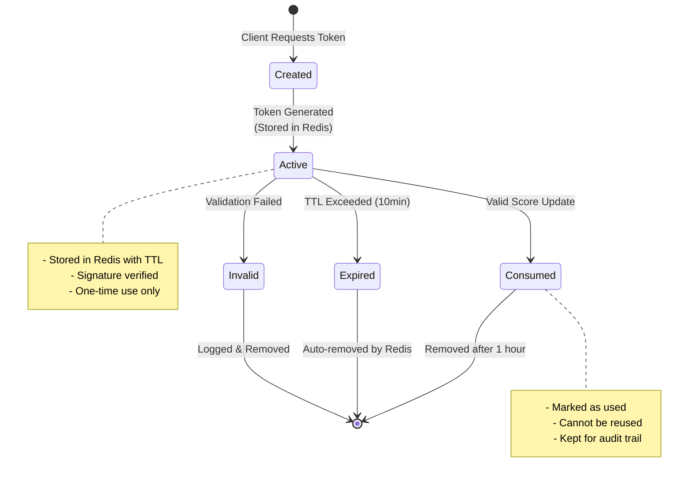

# Execution Flow Diagrams

## 1. Complete Score Update Flow (with Security)

## 2. Leaderboard Query Flow

## 3. WebSocket Connection Flow

## 4. Complete WebSocket Real-time Flow

## 5. Anti-Cheat Detection Flow

## 5. System Architecture Overview

## 6. Token Lifecycle Flow

